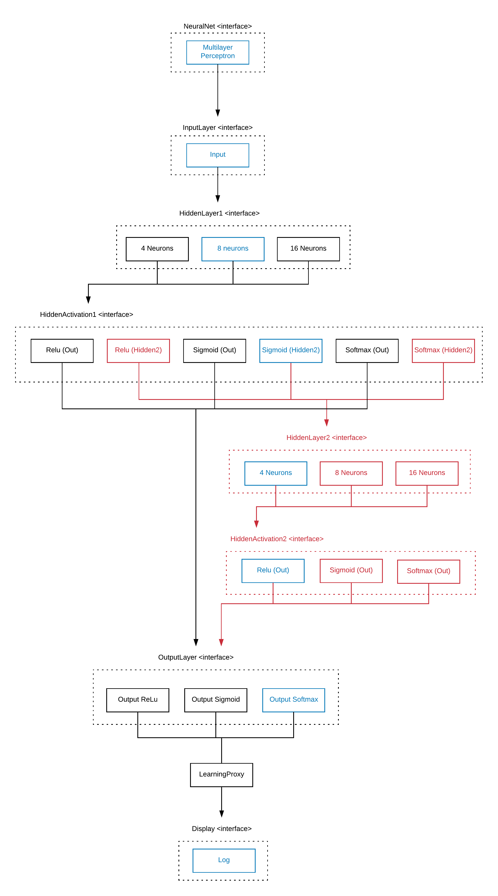

# Adaptive Multilayer Perceptron

A self adaptive artificial neural network implemented with the component-oriented language, DANA.

Artificial Neural Networks (ANN) are computing systems inspired by the biological structure of the human brain that together with different machine learning algorithms can process complex data inputs with remarkable results. The neural network is not an algorithm, but a framework which is based on a collection of connected units called artificial neurons, each collection is defined as a layer with a specific number of neurons. The learning process is usually based on the standard backpropagation algorithm, gradient descent, which updates the each neurons’ weight every epoch. The gist of this proposal is to be able to change the artificial neural network architecture in respect to the number of neurons, number of layers, and activation functions in running time by building it around the component-oriented paradigm language. For the most implementations of neural networks, any change of configuration of its architecture requires a new training of model. Therefore, the necessity of retraining in every configuration change impacts the overall search for a good configuration for the neural network architecture.  
Consequently, the main objective is answer two questions:  

	What will happen with the ANN training time and its convergence?  
	What would the impact in the overall accuracy?

The experiments are based on two datasets:  

	Iris Flowers
	Minist Digits

# Architecture

# How to run

Compile Project

dnc .

Compile and Run pal

dnc . -sp "../repository;../Project"

dana -sp ../Project InteractiveAssembly.o ../neuralnet/NeuralNetDemo1.o

Add Proxy

add_proxy |../pal/monitoring/proxies/NeuralNetProxy.o|*(*:OutputLayer[0]:*)|

set_config 1

get_all_configs
